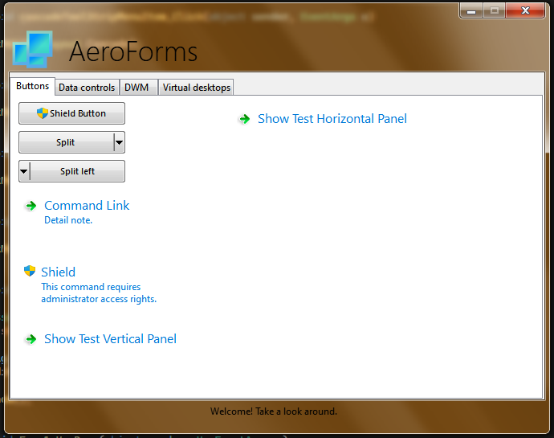

# AeroForms

**AeroForms** is an unofficial continuation of the [WindowsFormsAero](https://github.com/LorenzCK/WindowsFormsAero) library.<br>

**AeroForms** is a *Windows Forms* library that provides native controls with many of the modern features introduced with Windows Vista and more recent Windows versions.
Many controls—such as buttons, command buttons, and textboxes—support the functional and stylistic features introduced with “Aero”.
For instance shield icons, cue banners, and so on.



## Changes from **WindowsFormsAero**
- Migrated from **.NET Framework 4.6.1** -> **.NET 10.0** for better performance, feature support, and security
- Removed **TaskDialog** APIs as they are now included by default in **WinForms**
- Changed **SplitButton** to use **ContextMenuStrip** because **ContextMenu** is obsolete and throws `NotSupportedException` on constructor

## Download
[](https://www.nuget.org/packages/FireBlade.AeroForms)

Get the latest version through NuGet:

```
Install-Package FireBlade.AeroForms
```
